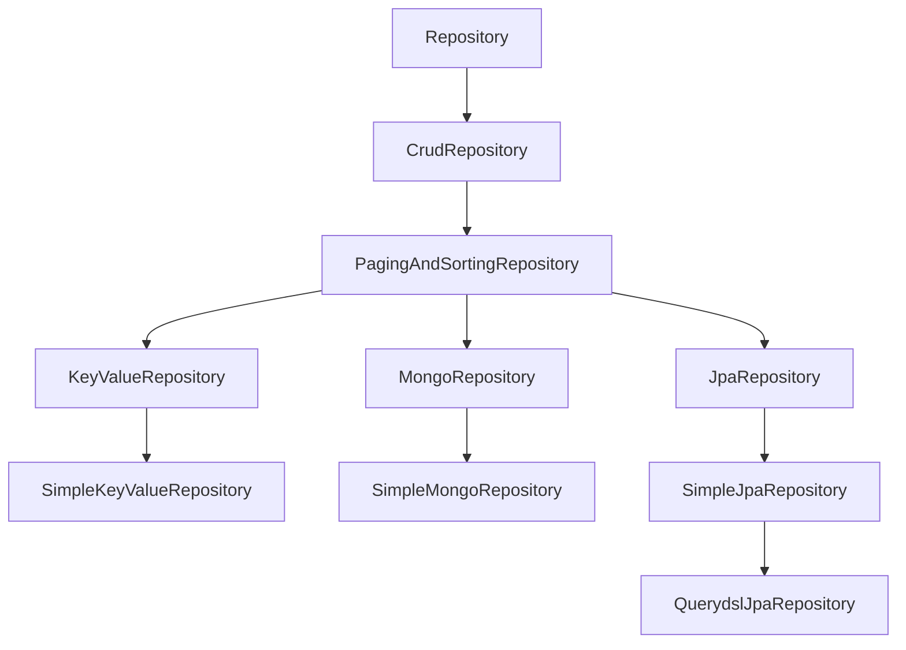
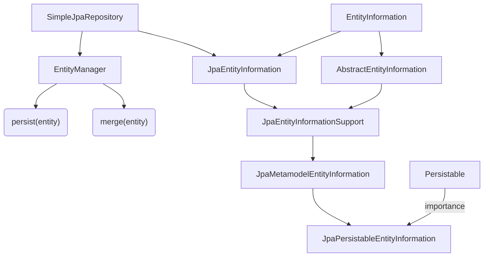
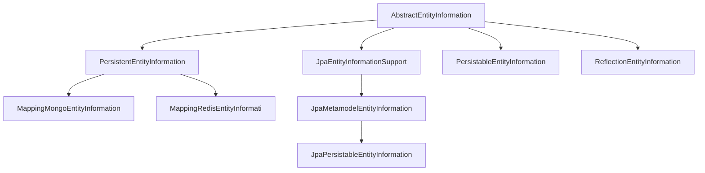
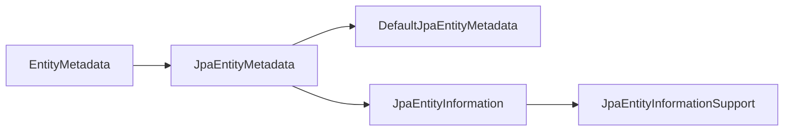

# Spring JPA save 实现主键重复抛异常

##  Introduction

### 先说说要做的功能

希望用数据库的 duplicate primary key 来实现一个简易的锁功能，加锁成功与否取决于是否成功 insert，此时必须要明确的执行 insert sql，而不是 update sql

本文以一个简单地订单锁作为例子，数据库字段信息如下：

```mysql
create table order_lock (
    order_number varchar(20) not null primary key,
    user_name varchar(100) not null,
    created_time datetime default CURRENT_TIMESTAMP null
);
```

### 再说说 JPA 的 save

JPA 的 save 默认会判断是否为新数据，若为新的则 insert / persist，否则 update / merge，而 JPA 对于是否为“新”的定义是。。。。

实际上在 save 时会生成两条 sql 语句分别执行：

```
Hibernate: 
    select
        orderl0_.order_number as order_nu1_12_0_,
        orderl0_.created_time as created_2_12_0_,
        orderl0_.user_name as user_nam4_12_0_ 
    from
        order_lock orderl0_ 
    where
        orderl0_.order_number=?
[V][2019-11-04 15:03:06,602][INFO ][http-nio-9091-exec-9][OrderLockService][lockOrder][][][][] - order lock start lock: order number:aaaaaaaaaaaaaaaa, user name: zzz2
Hibernate: 
    insert 
    into
        order_lock
        (created_time user_name, order_number) 
    values
        (?, ?, ?)
```

当我们第一次调用的时候，createdTime 自动生成，当第二次调用的时候，因为包含了这个字段，select 有了结果，第二个 sql 成为了 update：

```
Hibernate: 
    select
        orderl0_.order_number as order_nu1_12_0_,
        orderl0_.created_time as created_2_12_0_,
        orderl0_.user_name as user_nam4_12_0_ 
    from
        order_lock orderl0_ 
    where
        orderl0_.order_number=?
Hibernate: 
    update
            order_lock 
        set
            created_time=? 
        where
            order_number=?
```

good，我们第二次创建没有报错，但是 createdTime 成了 null

> 作为数据库的主键，唯一性已经保证了不会出现一个订单有多个锁的情况，若不希望自己主动地 find 后再 save，那就必须让 JPA 固定的生成 insert sql，利用 db 报错来发现重复锁的问题
>
> 除此以外第二个问题，每次 save 都会先 select，对于 db 通过主键就能判断成功与否的需求，却执行了两个 sql 性能上浪费 50%

### 结论

时间很宝贵，先给出最后的结论，再记录翻源码的过程

### 方案 1 - 优雅的解决问题

自定义的 Entity class 实现 Persistable interface 的 isNew method，固定返回 true，则在 JPA save 时一定会执行 insert sql，对于简单地订单锁的 Entity 如下：

```java
@Entity
@Data
@NoArgsConstructor
@AllArgsConstructor
@Table(name = "order_lock")
public class OrdertLock implements Persistable {
    @Id
    private String orderNumber;

    @Column(updatable = false, nullable = false)
    private String userName;
    
    @CreationTimestamp
    private Date createdTime;

    @Override
    public Object getId() {
        return orderNumber;
    }

    @Override
    public boolean isNew() {
        return true;
    }

    @Override
    public boolean equals(Object o) {
        if (this == o) {
            return true;
        }
        if (o == null || getClass() != o.getClass()) {
            return false;
        }
        OrderEditLock orderEditLock = (OrderEditLock) o;
        return Objects.equals(orderNumber, orderEditLock.orderNumber);
    }

    @Override
    public int hashCode() {
        return Objects.hash(orderNumber);
    }
}
```

#### 看看修改后的 JPA 行为

JPA 直接生成了 insert 语句，select 也没有生成，一个 sql 解决问题。

```
Hibernate: 
    insert 
    into
        order_lock
        (created_time, user_name, order_number) 
    values
        (?, ?, ?)
```

当主键重复的时候抛出`org.springframework.dao.DataIntegrityViolationException；com.mysql.jdbc.exceptions.jdbc4.MySQLIntegrityConstraintViolationException: Duplicate entry 'XXXXXXXXX' for key 'PRIMARY'`

### 方案 2 - 万能的 `@Query` 解决一切

Entity 不做改变，直接 Repository 自定义 Query

```java
@Modifying
@Query(nativeQuery = true,
       value = "INSERT INTO " +
       "order_lock(order_number, user_name) " +
       "VALUES (:orderNumber, :userName);")
void lockOrder(@Param("orderNumber") String orderNumber,
               @Param("userName") String userName);
```

此时也是生成一个 sql：

```
Hibernate: 
    INSERT 
    INTO
        service_order_edit_lock
        (order_number, user_name) 
    VALUES
        (?, ?);
```

若主键重复抛出异常一样是：`org.springframework.dao.DataIntegrityViolationException；com.mysql.jdbc.exceptions.jdbc4.MySQLIntegrityConstraintViolationException: Duplicate entry 'XXXXXXXXX' for key 'PRIMARY'`

> 注意：生成的 sql 对于未填写的字段处理方式不同，一个是 field 全量生成 sql， 一个是可以自定义传递哪些 field
>

## 沉入源码

> 先上个关系图，Markdown写的，不是 UML，箭头指向方向为实现/继承/依赖……反正就是起点用到了终点。。。。原谅我偷懒



最下面一层是实现，上面都是 interface，对于 key-value、mongo 不在本文范围内

org.springframework.data.repository.Repository/CrudRepository/PagingAndSortingRepository

这都是接口，Spring 可以自动注入，肯定有默认的一个实现用于生成 Bean。无论是默认的是什么实现，好像都与解决方案无关，除非我们自定义一个，（0.0），这应该算是解决方案 3 吧

> 此处可以自行查阅自定义 Repository 方法，提供关键词：@EnableJpaRepositories、@EnableDiscoveryClient、@NoRepositoryBean

下面一个图主要针对 SimpleJpaRepository 研究



 - org.springframework.data.jpa.repository.SimpleJpaRepository
    > 注意，这里 package 属于  JPA 了，对于 Mongo，Key-value 等也有还有其他对应的实现，看一下他的 save api
    
    ```java
    JpaEntityInformation<T, ?> entityInformation；
    @Transactional
	public <S extends T> S save(S entity) {

		if (entityInformation.isNew(entity)) {
			em.persist(entity);
			return entity;
		} else {
			return em.merge(entity);
		}
	}
    ```


 - org.springframework.data.jpa.repository.support.JpaEntityInformation
   
   > 这也是一个接口，没有涉及到 isNew
   
 - org.springframework.data.repository.core.EntityInformation

    > 注意，这里又回到了 Spring.data package 有 isNew 了，看 package，isNew 属于 repository 而不是 JPA

 - org.springframework.data.repository.core.support.AbstractEntityInformation
   > 开始就是看到了这里，很神奇的认为 SimpleJpaRepository 调用的 entityInformation 就是这个实现了，他只判断了是否为基本类型，是否为 null……于是就优先用方案 2 解决了问题

   ```java
   public boolean isNew(T entity) {
   
   	ID id = getId(entity);
   	Class<ID> idType = getIdType();
   
   	if (!idType.isPrimitive()) {
   		return id == null;
   	}
   
   	if (id instanceof Number) {
   		return ((Number) id).longValue() == 0L;
   	}
   
   	throw new IllegalArgumentException(String.format("Unsupported primitive id type %s!", idType));
   }
   ```

 - org.springframework.data.jpa.repository.support.JpaEntityInformationSupport

   > 这才是 JPA 的舞台

   ```java
   public abstract class JpaEntityInformationSupport<T, ID> extends AbstractEntityInformation<T, ID>
   		implements JpaEntityInformation<T, ID> 
   ```

 - org.springframework.data.jpa.repository.support.JpaMetamodelEntityInformation extends JpaEntityInformationSupport<T, ID>

 - org.springframework.data.jpa.repository.support.JpaPersistableEntityInformation<T extends Persistable<ID>, ID> extends JpaMetamodelEntityInformation<T, ID>

   ```java
   public class JpaPersistableEntityInformation<T extends Persistable<ID>, ID>
   		extends JpaMetamodelEntityInformation<T, ID> {
   
   	public JpaPersistableEntityInformation(Class<T> domainClass, Metamodel metamodel) {
   		super(domainClass, metamodel);
   	}
   
   	@Override
   	public boolean isNew(T entity) {
   		return entity.isNew();
   	}
   
   	@Nullable
   	@Override
   	public ID getId(T entity) {
   		return entity.getId();
   	}
   }
   ```

> 现在 AbstractEntityInformation 的 isNew 已经被重写了，不再是使用 XXXXXXXEntityInformation 系列的接口，而是使用 entity 的 isNew 接口
>
> 注意类声明：想要触发这个实现，Entity 必须实现 Persistable interface，下面看看 Persistable

## Persistable

 - org.springframework.data.domain.Persistable 接口
    ```java
    ID getId();
	boolean isNew();
	```
    
 - org.springframework.data.support.IsNewStrategy 接口
   
 - org.springframework.data.support.IsNewStrategyFactorySupport

- ```java
  public final IsNewStrategy getIsNewStrategy(Class<?> type) {
  
  		Assert.notNull(type, "Type must not be null!");
  
  		if (Persistable.class.isAssignableFrom(type)) {
  			return PersistableIsNewStrategy.INSTANCE;
  		}
  
  		IsNewStrategy strategy = doGetIsNewStrategy(type);
  
  		if (strategy != null) {
  			return strategy;
  		}
  
  		throw new IllegalArgumentException(
  				String.format("Unsupported entity %s! Could not determine IsNewStrategy.", type.getName()));
  	}
  ```

 - PersistableIsNewStrategy

   > 实现了 IsNewStrategy，里面也涉及到了 Persistable，
   > 重点在这个实现了，如果 entity 实现了 Persistable 接口，则调用 entity 自己的 isNew

   ```java
   public enum PersistableIsNewStrategy implements IsNewStrategy {
   @Override
   public boolean isNew(Object entity) {
   
   	Assert.notNull(entity, "Entity must not be null!");
   
   	if (!(entity instanceof Persistable)) {
   		throw new IllegalArgumentException(
   				String.format("Given object of type %s does not implement %s!", entity.getClass(), Persistable.class));
   	}
   
   	return ((Persistable<?>) entity).isNew();
   }
   }
   ```

### 小结

这说明只要 entity 实现了 Persistable 接口，那么就可以在使 entity 对应的 EntityInformation 实现是：JpaPersistableEntityInformation，并通过一波操作将 EntityInformation 的 isNew 实际调用到 PersistableIsNewStrategy 的 isNew

   > 下面继续深挖一下，可以看到 table name 存在哪里

## 继续深挖

其实还有一个 `PersistableEntityInformation`:`org.springframework.data.repository.core.suppor.PersistableEntityInformation`



既然看到了 JPA 特殊照顾了 PersistableEntityInformation 的实现，那看看 JpaPersistableEntityInformation 还做了什么

```java
public class JpaPersistableEntityInformation<T extends Persistable<ID>, ID>
		extends JpaMetamodelEntityInformation<T, ID> {
		
	public JpaPersistableEntityInformation(Class<T> domainClass, Metamodel metamodel) {
		super(domainClass, metamodel);
	}
}
```

```java
public class PersistableEntityInformation<T extends Persistable<ID>, ID> extends AbstractEntityInformation<T, ID> {
	@SuppressWarnings("unchecked")
	public PersistableEntityInformation(Class<T> domainClass) {

		super(domainClass);

		Class<?> idClass = ResolvableType.forClass(Persistable.class, domainClass).resolveGeneric(0);

		if (idClass == null) {
			throw new IllegalArgumentException(String.format("Could not resolve identifier type for %s!", domainClass));
		}

		this.idClass = (Class<ID>) idClass;
	}
}
```

看一下特殊的构造函数：domainClass, metamodel

不看他的继承关系了，只看多了什么 method: 构造函数：domainClass, metamodel

### 买它模型（metamodel）



```java
public class DefaultJpaEntityMetadata<T> implements JpaEntityMetadata<T> {

	private final Class<T> domainType;

	public DefaultJpaEntityMetadata(Class<T> domainType) {

		Assert.notNull(domainType, "Domain type must not be null!");
		this.domainType = domainType;
	}

	@Override
	public Class<T> getJavaType() {
		return domainType;
	}

	@Override
	public String getEntityName() {

		Entity entity = AnnotatedElementUtils.findMergedAnnotation(domainType, Entity.class);
		return null != entity && StringUtils.hasText(entity.name()) ? entity.name() : domainType.getSimpleName();
	}
}
```

OK，到此我们知道了 entity 的名字来源了，或者说 "table name" 
