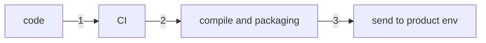
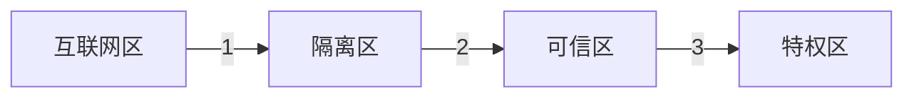

[toc]

历史车轮滚滚向前，时代潮流浩浩荡荡，社会不断地发展、演进，积累的人类宝藏（知识储备）越来越多，随着知识量的增加，人们越来越不能做到全知全能，逐步的开始根据能力、爱好、特长等等，进行职责的划分，各行各业，各式各样的生活方式不断涌现。

软件发展也是如此，随着科技的不断发展，软件与硬件的相辅相成互相促进，从最初的机器码“大佬”，到汇编语言“大牛”，从面向过程到面向对象的范式演进，从基础的 OO 到 DDD 的发展，从单体应用到微服务，随着业务规模的急剧膨胀，人机交互诉求越来越复杂，软件代码规模指数级增长。

代码量的提高让我们最终产品的可能暴露出的安全隐患越来越多，让我们从应用的生命周期来看一看，软件一生中的每一步可能会涉及到的安全问题。

`（个人理解，非安全领域的小猿，若有不当、不到位之处欢迎指出）`

# Predefine

从本文标题来看有三个关键词，应用、安全、软件生命周期

## 何谓应用

我想说软件安全，也想说网络安全，还想说产品安全，但我感觉可能应用更合适一些，因为总感觉生活中用到的软件、网络、产品这些词都像是再说我们作为“产品受众”来说所直接接触到的东西，当然也许我用应用也并不合适。

我认为的应用是：一切独立的可提供功能的被独立编译出来的文件。

无论是动态链接库、可执行文件、藏在容器里不知道自己还有兄弟姐妹的软件、虚拟机里以为这就是整个世界的程序、手机的一个 APP、浏览器看到的那个页面、嵌入式设备里容易被忽视的那些不间断运行的代码、设计出来的专用芯片中深入骨子里固化的逻辑……

无论他们是何种形态，都在独立的默默付出，或者协作着搞事情，但从软件的世界来看，就算独立的软件他们也在以“社会”这个中间媒介间接地交流着

> 为什么括号里再写个网络安全？可能现在不写网络，受众会很小吧

## 何谓安全

安全，我认为不止局限于是否能够抵御非正当的入侵手段，还应该能够做到在大量的正当行为同时发生时能够争取的有条不紊的处理（高并发情景）。

除此以外，在突发情况下（设备故障等），能够将手头正在做的事情适当的正确处理，以便于转交他人或事后完成（分布式事务）。

再除此以外，对于事实，无论何时我们都不应撒谎（幂等，最终一致性）

还可以再……

总之，作为一个应用，理应提供持续、稳定、正确、精准的价值输出。

## 何谓软件生命周期

> 哦，写到这我才发现写错了，准确来说按照我的定义要讲的是应用生命周期，nevermind……我相信认真读到这里的你并不介意，我要说的生命周期就是一个应用的

 一个软件或者说产品的开发过程，可能会随着业务的膨胀逐渐的分割成多个微服务，或者多个 lib，以控制每个应用开发者需要掌控、理解的代码规模，但是这个复杂过程我讲不出来呀……让我们只看一个应用吧^.^

一个生命从出生到死亡，他经历了孕育、诞生、生长、成熟、衰亡。从没有意识的“任人摆布”，到一脸懵逼的看到新世界；从对社会充满好奇心的探索，到看破红尘的淡然；在时代浪潮中拼命前进，从一个弄潮儿逐渐变得力不从心，最后挥一挥衣袖不带走一片云彩。

软件生命周期也是如此，当有一个新的 idea 后，我们决定搞起来；当自我感觉良好的时候，让他跑起来……

> 让我们来一起养成一棵树，树种-树苗-大树-树林-森林，来看看树生何其艰难险阻！

# 孕育 - 请给“树”一个好的基础

> OK，我们要找一个树种了，为了让树种有很大的几率破壳而出，直达云霄，我们需要找一个好种子，并勤奋的浇水施肥，为新生命的到来做好充足准备。
>
> 如同生命成长需要能量一样，一切应用都是由代码组成的，一个“茁壮”的应用一定要有良好的代码基础。

## 单人种树-艰辛也省心

`版本管理系统(VCS)`：单人开发的时候，也需要记录我们开发的经历，就如同我们对树种孕育的各个阶段都有所研究一样，我们必须要记录代码的成长 /  扩张过程，否则无法回顾 / 审查历史代码，这时候就需要用，比如`Git` 、`SVN` 等。(link: https://en.wikipedia.org/wiki/Version_control)

> 历史不可磨灭：版本管理系统一般以`有向无环图(DAG) `等手段，保证代码的历史不可被篡改(link: https://en.wikipedia.org/wiki/Directed_acyclic_graph)

`GPG秘钥`：树到底属于谁？自己的树只能自己浇水。那么就需要证明浇水的人是自己了，可以通过一系列 token 手段，告知 VCS 我是谁。(link: https://en.wikipedia.org/wiki/GNU_Privacy_Guard)

## 多人种树-众人拾柴火焰高

`代码审查`：健康茁壮的成长，我们要保证代码的质量，这时候就需要进行 code review，除此以外，当多人开发的时候，任何人都能轻易地改变代码，此时可以考虑使用类似于 Github pull request 的确认流程，使“浇水”的过程互相认证，以降低隐藏很深的漏洞。

`站在巨人的肩膀`：在无特殊要求的情况下，尽可能的使用已有的轮子，依赖成熟、主流、正确的库 / 框架，可以极大地减少项目代码规模，少写点 bug。(写着写着就收到了这么贴切的事件：https://www.zdnet.com/article/two-malicious-python-libraries-removed-from-pypi/)

> 一定要注意“正确的”库 / 框架，也许我们信任某个主流的库，但是引用错了，那真的会是一个隐藏在无限深处的坑。(link: )

`包完整性校验`：好不容易找到个喜欢的东西，我相信谁也不希望半路被掉包。一般认为是 HTTPS 的远程仓库，但实际上不一定靠谱，若使用 https，请先人工确认我们使用的远程库是可靠的（或者说是知名的吧），毕竟 CA 证书只能保证链路中的安全性，无法保证源头。(link: https://www.gnupg.org/gph/en/manual/x135.html)

> There are over 400 “Certificate Authorities” who may issue certificates for any domain. Many have poor security records and some are even explicitly controlled by governments. (link: https://whydoesaptnotusehttps.com/)#

## 团队种树-持续成长

当团队足够大，我们需要保证小树苗持续的成长。

`CI/CD`：持续集成、持续部署/交付，先让我们看看下面的过程(link1: https://en.wikipedia.org/wiki/Continuous_integration) (link2: https://en.wikipedia.org/wiki/Continuous_delivery) (link3: https://en.wikipedia.org/wiki/Continuous_deployment)

`TLS`：我们的代码从本地提交到 VCS，VCS 主动 push 或者 CI 主动 pull 代码，此时完成了第一步，这一步涉及到了网络通讯；同理对于编译、打包完成后的文件需要部署或者发布到产品环境，这是第三步，也有网络通讯。我们需要保证这两个过程的安全，可以通过主流的 TLS。(link: https://en.wikipedia.org/wiki/Transport_Layer_Security)

一般来说我们认为保证了通信过程安全就可以了，实际上不是的，我们不能保证应用在拿到数据后真的按照“规矩”办事，尤其是对于我们的 code，如果在“制造工厂”就出现了差错，那后续的一切行为都不在可控，所以上面解决了步骤一和步骤三的安全问题，对于在同一个“主机”运行的编译和打包过程，我们也应该以怀疑的态度去考察：

`可重现构建`：在 code 不变的时候，我们总是能够 build 出来的二进制码一样的目标对象。这样有助于我们定期的对 CI 系统是否“被入侵”、“被错误配置”进行检查。(link: https://en.wikipedia.org/wiki/Reproducible_builds)

> 这一部分认为团队共同 owner 一套代码，以小步提交为开发基础，在种树的时候才能稳稳地逐步发育成长，所以并未考虑本地积累大量代码后进行合并的问题。如果出现本地积累大量代码的情况，一般手段的代码审查已经不足以解决问题，此时的问题不止局限于代码层面的理解，还需要考虑业务 context 的共识。
>
> p.s. 当然我认为小步提交对于 Git 来说是指 push，对于敏捷来说小不提交是没有针对具体的版本管理系统的，我们共同管理一套代码，本地的 git commit 内容再多，我们种的树也没有成长。

总之，我们在开发过程要有防御性编程意识，不只是判断 NPE(null pointer exception, link: https://en.wikipedia.org/wiki/Null_pointer)，还要守护我们的代码，最终生成的是我们`想要的应用`。

# 诞生 - 给小树苗起个名办个证

我们有身份证、指纹、面部信息识别、瞳孔识别、基因、户口本、档案等等各种手段验证、证明“我是我”，那对于应用如何证明它是所声明的它呢？

`Certificate Authority(CA)`：我们想要证明一个应用就是他，首先要给他办法一个身份证，这时候就可以去找 CA 落户了。(link: https://en.wikipedia.org/wiki/Certificate_authority) (link2: https://en.wikipedia.org/wiki/X.509)

这就够了么？

`hardware security module(HSM)/trusted platform module(TPM)`: 我们不能把证书当做我们的身份证，对于应用来说丢失证书几乎是是无法挽回的伤痛，通过硬件的手段进行必要加密，降低系统被入侵后的风险。(link1: https://en.wikipedia.org/wiki/Hardware_security_module) (link2: https://en.wikipedia.org/wiki/Trusted_Platform_Module)

> CA 给我们的证书只能用于告诉别人“我是谁”，如何确认“我真的是谁”，就如同我们只说全面有个动物是没有感觉得，但是如果说前面有只老虎或者有只猫，我们会有不同的反应。CA 证书只告诉我们这是“这棵树”，并未告诉我们这是棵什么树。

`user persona`：我们不能在 2020 年即将到来的时候，还对跑在 win 98 下的 'Happy软件' 给予高度信任，也许它早就被入侵者改变了。设备的硬件信息、系统信息、运行时间等等，这一系列基础信息也应该作为对应用的描述，这算是我们对此应用的第一印象。(link: https://en.wikipedia.org/wiki/Persona_(user_experience))

# 生长 - 历经坎坷的树生

> 就算是成熟的大树，也应该小心身边的一切，就算是身边的小伙伴。这样讲是不是有点内心“黑暗”？并不是的！
>
> 相比于人，我们可以 face to face 的识人，但对于应用来说，想要 face to face 的了解另一个应用，这只能是一种奢望，所以在沟通的过程一定要小心不要被安排的明明白白。

## 齐心

> 步入学校，家校合作，遮风挡雨让小树苗茁壮成长

`边界安全模式`：传统的互联网安全往往使用这种模型，认为隔离区就是一把全民防御的保护伞，互联网区的各种通讯消息等等，都会经过隔离区的过滤，才会抵达可信区。而部分可信区的应用可以对特权区进行访问。通过层次划分实现了产品的保护。

> 上学的过程，小树苗认识了一堆小伙伴，随着不断地交流它们有了默契，决定一起搞事情

随着业务的膨胀，微服务的到来，服务之间合作共赢，高效率的解决复杂问题，看似美好的事情，但……内忧外患无法避免。

## 变心 - 外患

我们的`隔离区`保护伞，真的能保护一切么？不是的，因为我们无法保证每个运行于可信区的应用都没有漏洞，此时最大的风险是：

某个应用被入侵，此时入侵者成功跨过隔离区，可以在可信区中畅通无阻的`横向移动`，甚至更进一步抵达特权区。

## 伤心 - 内忧

我们如何保证每个应用自己不是“邪恶”的？也许小伙伴并不是我们想的那样，有可能是对 api 理解的错误，也有可能是未知的开发者遗留的 bug。当然前面的外患也是来源于我们对小伙伴无条件的信任。

> 最初接触编程的时候，我以为 `stack.pop()` 出来的元素只是临时让我看看，它还一直被`stack`保存着，后来我才知道，原来这样是被“消费”了，无意间我销毁了很多数据。幸运的是，那只是自己随便写的应用。

错了，更准确的、正确的说，我们是对“它说它是我们的小伙伴”的应用无条件的信任。

# 成熟 - 理性的分析事物，辩证的看待问题

> 若一味地信任，和“小伙伴”一起在冲锋陷阵，毫不设防的将后背给了“小伙伴”这是很危险的，在不能 face to face 的了解它的情况下，我们怎么知道“它就是它”？并且它在成长过程坚持着“不忘初心”？或者说如何判断对方是它所声明的主体？

前面我们记录了应用出生时的各种信息，知道了他的设备、运行时间等等特征，但这是不够的，就如前面说的“不忘初心”这一点都是需要证明的，这就需要时刻的监控应用的行为。

我们可以监控应用访问资源的频率、访问资源的级别、访问的时间区段等等，通过一系列的行为信息作为基础，来判断此次行为是否为“主观的”行为，通过对异常行为的监控、二次验证等等途径，来确定`"应用 = 所声明主体"`

`user profile`：不同于 persona，此画像是基于大量行为数据统计、沉淀出来的用户特征。(link：https://en.wikipedia.org/wiki/User_profile)

通过 persona 和 profile 的联合，我们可以动态的确定应用的“真实度”，或者说“可信度”，通过一系列的数据与当前行为的匹配，可以给出此次行为的量化评估指标，用以分析是否允许此行为。

动态的判定，可以适应不断变化的环境。

应用、行为、设备的综合指标，给每个应用独有的保护层，不再依赖于传统隔离区的可靠性，同时具有横向移动风险的抵御能力。

> 远程办公的客户端怎么办？

这个问题又回来了开头的定义，一切都是应用，此时已经没有了前后端、客户端、微服务的独立属性，都是应用，那么都具有自己的“应用、行为、设备”的指标，想要区分，可以给用户的手机、非公司内的电脑相对的低分。

> 用户的怎么办？

用户不会独立的存在，一定是通过某个客户端实现的接入，那这个客户端就是应用。当然我这里说的接入，也是不局限于网络通讯，通过 USB 驱动接入的 U 盘，也算是用户的一种行为，如果确实有这个非功能需求，那理应在此处进行校验。

# 衰亡 - 结束何尝不是新的开始

应用的衰亡本身也是演进的证据，如果应用能够一直产生足够的价值，我想它只会持续的存在着，不断地演进着。

# 总结

## 应用安全

一个产品就是一个庞大的生命，虽然最终的产品被拆分成了多个应用，但每个应用也具有其独立主格，理应充分地给予其完整的生存权。

每个应用作为独立的主体，理应“从来不信任，始终在校验”，并通过各种现实情境中的“训练”，使其做到“自立、自强、自信”。

自信：来源于应用在孕育过程尽可能充分地考虑，应用在成长到成熟的乘风破浪经历。

自立：应用在环境各种变动下，始终屹立不倒的提供持续、稳定、正确、精准的价值输出。

自强：在内忧外患的磨难中成长，在风雨交加的变迁中演进，敏捷的响应各种改变，披荆斩棘，向着远方小步快跑。

## 价值权衡

脱离背景谈方案，一切都是扯淡。

真的有必要对一个本地的简易计算器做XXXX、XXXX2、XXXX3、XXXX4……全方位保护么？

开发最终的目的还是要交付价值，无论是对自己、对公司、对社会的价值。而安全可以算是一个产品的非功能性需求（安全产品除外），那么需要做到的安全层级，一定要从安全的价值、受众群体、风险来源、商业/产品竞品等等多个维度考察，而不是一味地投入。

就算是同样的安全需求，在不同的业务、代码现状 context 下，如何做抉择？

## 与应用共情

也许在工作生活中我们能与他人共情，但对于无生命的个体呢？实际上一个产品在开发、创作过程中，作为开发者来说，我们就是在逐渐地赋予其生命。

应用只会通过正确 / 错误的 IO（输入输出）与我们交流，想要充分地了解它，首先我们应该理解应用的价值，或者说应用的业务背景，尝试设身处地的为这个生命考虑，让我们创造的生命更加完美。

# Bibliography

all in (link XXXXX)

# Acknowledgement

感谢零信任概念提出者 John Kindervag，感谢《零信任网络》作者 Evan Gilman、Doug Barth，感谢奇安信身份安全实验室译者团体。无论是编程过程中主动的防御性编程，还是在软件发布、部署、交互过程的安全意识，阅读此书，让我重新审视以往开发过程中的每一步。

