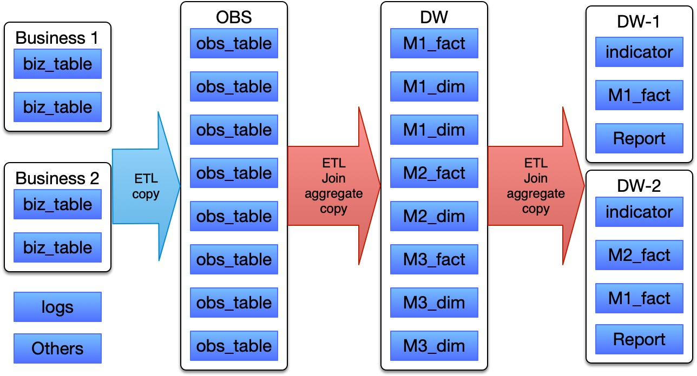
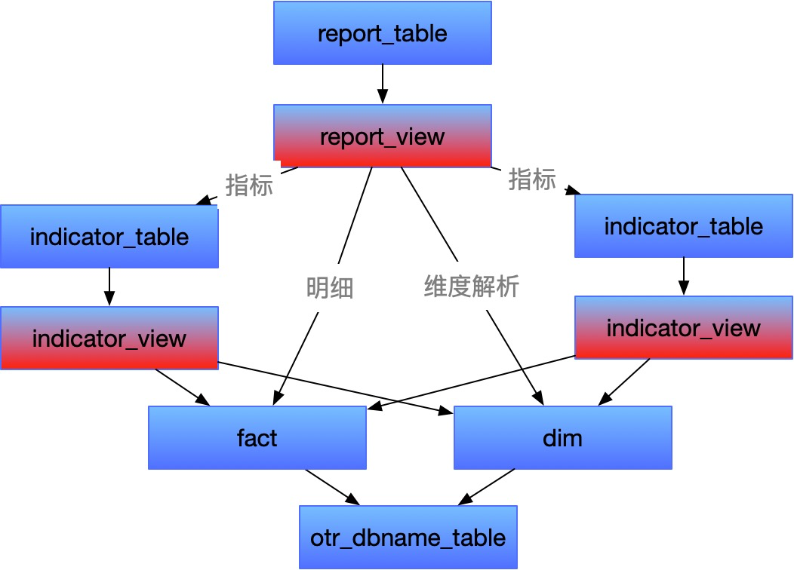
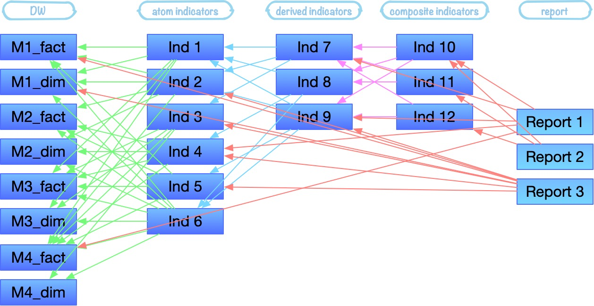

前面的《[报表自动化: 没有压力的维度建模](https://www.coologic.cn/2020/03/1762/)》以及《[报表自动化: 薅出数字背后的价值](https://www.coologic.cn/2020/03/1769/)》两篇文章分别提及了维度建模中的**事实**、**维度**，以及**指标**三种表，那么他们之间具体有什么关系呢？前面都零星提到了一些，现在让我们来具象化的了解一下这个关系。

# 存放在哪

继续上之前手残画的图：

其中模型，在维度建模中就是事实和维度了，为这张图已经直观的展示出了三者放在那里了：

- 简单的情况：DW 库存放事实和维度，DM 库存放指标
- 复杂的情况：DW 存放事实和维度，同时存放不同团队、业务、产品公用的通用指标；DM 各个业务、产品的仓库拉取需要用到的 DW 库里的模型以及通用指标，并构建一定的专用模型以及大量的自己的专用指标
- 极简的情况：也许根本就没有区分 DW、DM 两层数据库，一个库里搞定了

上面提到了通用、公用的概念，这就类似于 JAVA 代码或者说是我们常规的后端服务开发代码里面的抽取重复代码了，但是在数仓里面的抽取要注意：**逐层下沉**，满足复用需要即可

# 依赖关系

上面只显示了各层数据库要如何存放，那么他们是如何构建成这个层次分明的金字塔呢？

### 强 ETL 方案

先来展示一种在流程上来说简单的依赖方式，这种方案里的 ETL 工具非常强大，完成了绝大部分事情，也可以说是一种重度使用 / 依赖 ETL 工具的方案。

> ETL: Extract-Transform-Load的缩写，用来描述将数据从来源端经过抽取、转换、加载至目的端的过程。
>
> 一般来说具有如下功能：连接数据库、能够执行数据库 select / insert / update / upsert ……语句、执行数据库存储过程、一些工具的环境变量自变量、在工具里进行跨表与跨库的查询结果集 join、union、aggregate 等操作 / 计算………………

图中所有蓝色块都是数据表或者说是数据集。

- **收集**：通过 ETL 实现“收集”工作，将不同数据源的表拷贝到 OBS 层，这一步一般只是单纯的拉取数据，如有必要进行轻量级的数据库处理
- **整理**：通过维度建模的手段，找到数据之间的关系，构建多个 model，并确立事实表、维度表字段，实现多个独立领域并将表创建到 DW 层，并用 ETL 工具从 OBS 不同的数据库里找到每个字段的数据，拷贝、计算得到结果并存入模型中
- **分析**：继续 ETL 处理逻辑，可能需要读取多个模型里的事实、维度来计算得到指标，然后再用 ETL 把指标拼接成报表

### 弱 ETL 方案

这种方案里面通过 view 来承载逻辑，ETL 工具只做表对表、视图对表拷贝，这种方案下 ETL 就成为了一个将 view 逻辑计算结果“持久化”/“固化”到 table 的工具

这个方案看起来简单了很多，但是由于 view 不能跨库拷贝，我们明确的知道 fact / dim 在 dw 库，实际上图中还应该再添加一步将当前 dm 库用到的公用的事实与维度从 dw 库先拷贝到自己的 dm 库里。

> 把用到的 fact / dim 拷贝到当前 dm 库中，这一步在数仓足够庞大时候是应该有的，否则如果有五十个业务各自有 dm，每个里面都有 100 个指标涉及到了这个公用的 fact，每次在计算的时候都通过 ETL 工具从 dw 库拿。。。。那可能要为每五分钟计算一次的 5000 指标提供服务呀……
>
> DW 层重点还是个内部的整理仓库，并不是直接和外界进行资源交互的集市

### 对比

**强 ETL** 中如果有复杂逻辑，在 ETL 里面**操作会复杂**很多，没有写 view 容易（ETL 可以支持多种语言写的逻辑代码），但是它可以直接进行跨库的多表  join；同时数据库只需要提供 IO 流支持不需要进行复杂的运算逻辑，所有复杂运算都由 ETL 服务器承载；同样的如果有多个大表的 join 操作可能对 ETL 压力会很大，并且可能会出现某些数据**重复查找读取**走网络流量。（此方案请保证足够的内网带宽）

**弱 ETL** 中对于复杂逻辑可以直接 view 实现，极大的降低了 ETL 的配置操作，但需要 ETL 解决 view 不能进行跨库操作的问题或者通过先拷贝到一个库再计算来解决；由于对 ETL 依赖降低，此方案具**有强大的可移植性**，可以轻松更换工具；对**数据库压力大**，要同时进行复杂计算和 IO 操作，尤其是在大量 job 并发时

> 不要跨层调用，千万要避免破窗效应。
>
> 有需要从下层先拿过来或者边拿边算，下层没有就告诉它让他找到准备好，构建好我们的多级经销商体系。
>
> 跨层将会导致层次折叠，随着时间的流逝，我们的千层蛋糕将被压烂。

# 维度与指标的分层

前面的依赖关系看起来很简单呀……让我们拿起放大镜重新看看依赖关系

维度分层：无论是**原则维度、衍生维度**还是什么，最后总会构成一个雪花模型（甚至更复杂），维度的分层并不会对依赖关系产生较大影响，维度分层在使用过程中更像是我们从树的根节点逐步走向一层层的子节点，甚至是走向叶子节点的过程

指标分层：指标涉及到很多复杂的运算逻辑，数仓是要提供数据的，所以运算逻辑是不建议传播给其他指标或者服务的，那么复杂的问题就来了，假设只是按照**原子指标、衍生指标、复合指标**三层来看，我们的设计会成为什么样呢？

我们假设已经将需要用的 DW 层模型考到了我们业务专用 DM 库中了，那么我们的 DM 库里可能是这样的：

> 这个图里三层指标还是比较老实的，只用了上一层的内容并没有天南海北的四处拿数据，看起来 Report 2 是最单纯的了
>
> 也许我不让他们显示出来箭头会是一个相对美好的事情  0.0

# 如何设计

>  这一小节本应是独立的一篇甚至两篇文章，但是近期时间安排不足所以强行在这里插播一下简述

设计一定不是凭空出现的，虽然可以不断地演进，但是数据库的操作改动起来相比于后端服务代码来说要**困难**很多，因为没有那么多的**重构工具**让我们快速的去做改动，同时数据库**同时承载了逻辑与数据**，任何改动都需要考虑对当前数据的影响及改动行为需要**执行多久**。

> 执行多久：比如给 1 亿条数据的表加个有默认值的字段、加个索引是要并不是创建个表那么“瞬间”，比如给已经分库分表的……

那么让我们尽可能开始的时候创建一个好的基础，尽量满足我们的诉求，使后续的开发过程只需要进行横向的扩充，进而避免短期内大范围的重构成本。

最后千万不要错误的理解维度模型，他并不是规模的牺牲品，每个模型都是有自己的领域边界的，否则混乱的设计下维度建模会恶化下去，让我们来看一种错误的理解：**““**星型模型->雪花模型->星座模型->星系模型->混沌模型->遗留系统改造模型**””**

剪不断理还乱，我们要适当的着眼未来进行一定**设计**，并尽早的**解耦**，让我们明确领域，保证每一次使用与提供的都是数据而不是逻辑（这里后面文章会详细讲解）

感谢阅读，欢迎关注微信公众号：coologic

报表相关的系列文章请参考：

- [报表自动化: 商业智能背后的秘密](https://www.coologic.cn/2020/02/1746/)
- [报表自动化: 打开数据仓库的大门](https://www.coologic.cn/2020/02/1756/)
- [报表自动化: 没有压力的维度建模](https://www.coologic.cn/2020/03/1762/)
- [报表自动化: 抓住时间流逝的瞬间](https://www.coologic.cn/2020/03/1767/)
- [报表自动化: 薅出数字背后的价值](https://www.coologic.cn/2020/03/1769/)